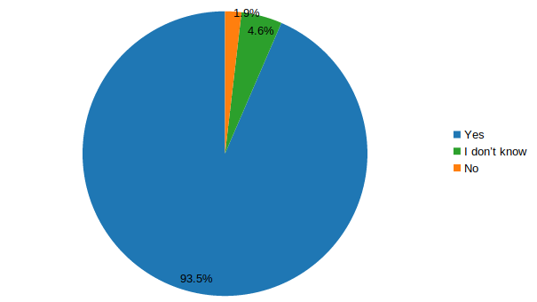

Survey
======

A survey was sent out to the students of the course 
`Mathematical Analysis II (STÆ205G) <https://edbook.hi.is/stae205g>`_ at the 
University of Iceland in the spring of 2019. Most of the students are engineering students in their first year. They are familiar with the Edbook notes both from this course and the course
`Mathematical Analysis I <https://edbook.hi.is/stae104g>`_. In other courses (e.g. Linear Algebra) they have had lectures with slides. In all three aforementioned courses the teachers used the whiteboard along with the slides/Edbook notes. Out of 241 student, 108 answered the survey. 

Where do students you look for information about the subject of the course?
~~~~~~~~~~~~~~~~~~~~~~~~~~~~~~~~~~~~~~~~~~~~~~~~~~~~~~~~~~~~~~~~~~~~~~~~~~~

.. image:: ./figure1.png
    :width: 80 %
    :align: center

Almost all of the students use the Edbook notes for finding information about the course content. Additionally they use various internet sources and the textbook. Most of the students who selected Other mentioned internet sources like YouTube and Chegg. This shows that the Edbook notes are a principle part of the course material which students use outside the classroom.

Usage
~~~~~

.. image:: ./figure2.png
    :width: 80 %
    :align: center

Not surprisingly majority of the students (97%) use the notes non-linearly, i.e. to look up things. Since this is the main course material resource this was expected. Majority of these students (55%) also read it linearly.

Usefulness 
~~~~~~~~~~

It is not surprising that students found the Edbook notes useful since the teacher used these notes in lectures and they reflect his emphasis in the course. But since only two students said that the notes where not helpful it suggests at least that in general students found them understandable.

Preferred arrangement of lectures
~~~~~~~~~~~~~~~~~~~~~~~~~~~~~~~~~

.. image:: ./figure4.png
    :width: 80 %
    :align: center

Most of the students are happy with the currents arrangement in lectures, which is a combination of going over the Edbook notes with explanations and sketches on the whiteboard. Some of the students (11 students, 10.2%) prefer slides but most of them (9 out of 11) wanted a combination of slides, Edbook and/or whiteboard. Almost all of the students who mentioned something else than these three options wanted videos, often in the context of a flipped classroom.

Importance of different properties of Edbook
~~~~~~~~~~~~~~~~~~~~~~~~~~~~~~~~~~~~~~~~~~~~

.. image:: ./likert.png
    :width: 80 %
    :align: center

The students where asked about the importance of different properties of the Edbook notes.
Not surprisingly the language and accessibility where of great importance to the students. But the most surprising part was that the printable PDF-version was of least importance. Perhaps this should be taken as a sign of students preference for digital material. 

Other remarks
~~~~~~~~~~~~~

The survey also included a text-box where students could mention other things related to the Edbook notes and the course. Beside expressing their satisfaction with the system students called for more examples in the notes. This is clearly something which has to be looked into. But as discussed below, the plan is not to expand the notes into a textbook so this has to be done carefully.

